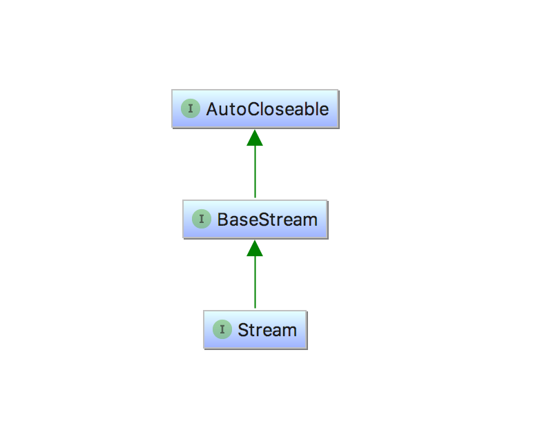
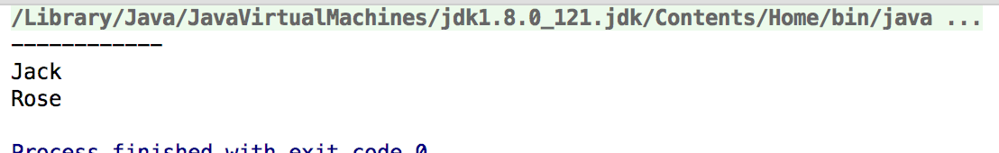

## Java 8入门

用来记录Java 8学习，以及常用API的使用。

## 目录:

- [函数式编程](#函数式编程)
- [Lambda表达式](#Lambda表达式)
- [Stream流](#Stream流)
	* [collect方法](#collect方法)
	* [filter方法](#filter方法)
	* [map方法](#map方法)
	* [flatMap方法](#flatMap方法)
	* [max和min方法](#max和min方法)
	* [reduce方法](#reduce方法)
	* [其他方法](#其他方法)
- [高效Java 8编程](#高效Java8编程)
- [超越Java 8](#超越Java8)
- [其他](#其他)
	* [Optional](#Optional) 
	* [DateTime](#DateTime)	
- [参考链接](#参考链接) 	

## 函数式编程
函数式编程是一种编程范式，它的主要思想是把函数过程尽量写成一系列嵌套的函数调用。具有以下几个特点

* 函数是一等公民:函数和其他数据类型一样，可以赋值给其他变量，也可以作为参数，传递给另外一个函数，或者作为返回值返回。

* 没有副作用，不修改状态。

* 强调将计算过程分解成可复用的函数。

## Lambda表达式

>Lambda表达式没有名字，当它有参数列表、函数主体、返回类型，可能还有一个可以抛出的异常列表。

|使用案例|Lambda示例|
|---|---|
|布尔表达式|(List<String> list) -> list.isEmpty()|
|创建对象|() -> new User()|
|消费一个对象|(User user) -> {System.out.println(user.getName;)}|
|从一个对象中选择/抽取|(String s) -> s.langth()|
|组合两个值|(int a, int b) -> a * b|
|比较两个对象|(User a1, User a2)|

### 函数式接口

函数式接口就是仅仅声明了一个抽象方法的接口，不过函数式接口可以包含默认方法和静态方法。如下：
	
	@FunctionalInterface
	public interface FunctionInterfaceDemo {
	
	    void test();
	
	    static void say() {
	        System.out.println("hello");
	    }
	
	    default void play() {
	
	    }
	}

### Java 8中重要的函数式接口

下面是Java 8中一些常用的函数式接口。

|接口名|参数|返回类型|示例|
|:--|:--|:--|:--|
|Predicate\<T>|\<T>|boolean|判断是否|
|Concumer\<T>|\<T>|void|输出一个值|
|Function\<T>|\<T>|R|获得Artist对象的名字|
|Supplier\<T>|None|T|工厂方法|
|UnaryOperator\<T>|T|T|逻辑非(!)|
|BinaryOperator\<T>|(T, T)|T|求两个数的乘积(*)|

## Stream流

Stream是一个借口继承了BaseStream接口，BaseStream接口继承了AutoCloseable接口。它只能被消费一次，如果想要继续使用，需要重新创建一个流。如下会抛出异常。
	
	List<String> strs = Arrays.asList("A", "B", "C");
	Stream<String> s = strs.stream();
	s.forEach(System.out::println);
	s.forEach(System.out::println);
	
### 内部迭代实现机制
外部迭代:首先调用Iterator方法，产生一个新的Iterator对象，进行控制迭代过程。

内部迭代:首先调用stream方法，它的作用和iterator()方法一样，不过它返回的是内部迭代中相应的接口Stream。这样做的好处就是在迭代时要进行多次操作时可以不用多次循环，只需要迭代一次就好了。
像filter这种不产生新集合的方法叫做[惰性求值](https://zh.wikipedia.org/wiki/%E6%83%B0%E6%80%A7%E6%B1%82%E5%80%BC)方法，像count这样最终会从Stream产生值的方法叫作及早求值方法。

例子：

	User jack = User.of("Jack", 21, "杭州");
	User rose = User.of("Rose", 18, "杭州");
	List<User> users = Arrays.asList(jack, rose);
	users.stream()
	     .filter(user -> {
	         System.out.println(user.getName());
	         return user.getAge() > 20;
	     });
	System.out.println("------------");
	users.stream()
	     .filter(user -> {
	         System.out.println(user.getName());
	         return user.getAge() > 20;
	     }).count();

输出：

结论：只有在需要的时候进行计算可以更好的提示效率

### collect方法
将Stream流转换为一个集合
	
	#输入
	Stream<String> stream = Stream.of("a", "b", "c");
	List<String> strs = stream.collect(Collectors.toList());
	strs.forEach(System.out::println);
	#输出
	a
	b
	c
	

### filter方法
过滤掉流中不符合条件的元素
	
	#输入
	Stream<Integer> nums = Stream.of(18, 19 ,20);
	nums.filter(num -> num > 18).forEach(System.out::println);
	
	#输出
	c

### map方法
将流中的元素转换为另外一个元素。

	#输入
	Stream<Integer> nums = Stream.of(18, 19 ,20);
	map(num -> num + 100).forEach(System.out::println);
	
	#输出
	118
	119
	120

### flatMap方法
将底层的元素全部抽出来放到一起，如下将List中的元素全部抽取出来，流中只包含Integer元素。

	List<Integer> nums1 = Arrays.asList(1, 2, 3);
	List<Integer> nums2 = Arrays.asList(4, 6);
	Stream.of(nums1, nums2).flatMap(num -> num.stream()).forEach(System.out::println);

### reduce方法
将Stream流中的数据聚合成一个数据

	#输入
	int ages = Stream.of(1, 2, 34).reduce(0, (a, b) -> a + b);
	System.out.println(ages);
	
	#输出
	37
	

### 其他方法
* skip：跳过指定个数的流。
* limit：返回不超过给定长度的流。
* max：找到最大的元素
* min：找到最小的元素
* findFirst：找到第一个匹配元素
* findAny：获取任意一个元素
* anyMatch：是否存在一个匹配元素
* noneMatch：是否全部不匹配
* allMatch：是否全部匹配
* sorted：排序
* distinct：去重

## 高效Java8编程

## 超越Java8

## 其他

### Optional

### DateTime

### 数组
	
	String[] strs = {"A", "B", "C"};
	
	String[] strs = new String[]{"A", "B", "C"};

## 参考链接

1. [函数式编程入门教程](http://www.ruanyifeng.com/blog/2017/02/fp-tutorial.html7)
2. [Java 8开发的4大顶级技巧](http://www.importnew.com/22417.html)
3. [Java 8 Optional: How to Use it](http://blog.jhades.org/java-8-how-to-use-optional/)
4. [Java 8学习资料汇总](http://ifeve.com/java8-learning-resources/)
5. [Java 8中Stream详解](https://www.ibm.com/developerworks/cn/java/j-lo-java8streamapi/)
6. [Java 8 API在线版地址](http://docs.oracle.com/javase/8/docs/api/index.html)
7. [《Java8实战》](https://book.douban.com/subject/25912747/)
8. [《Java8函数式编程》](https://book.douban.com/subject/26346017/)
9. [《写给大忙人看的Java SE 8》](https://book.douban.com/subject/26274206/comments/hot?p=1)

